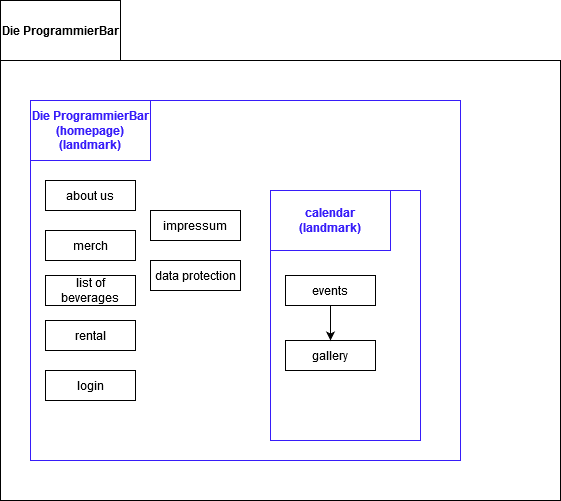
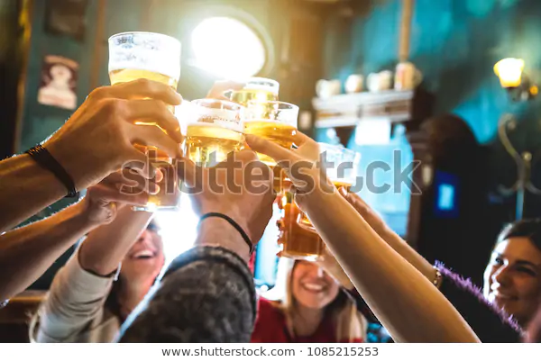
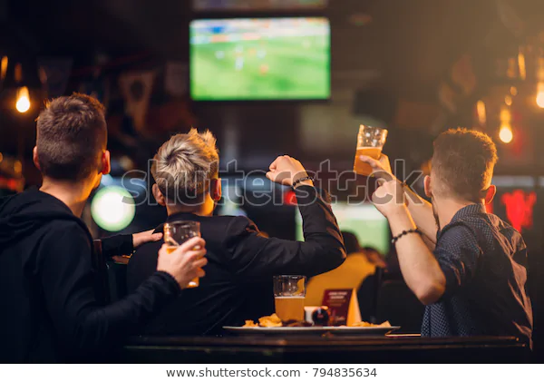
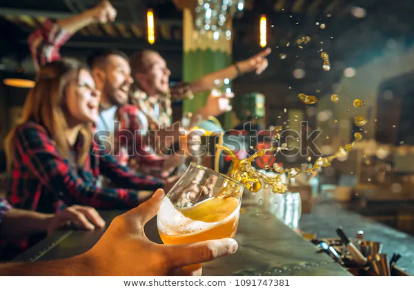
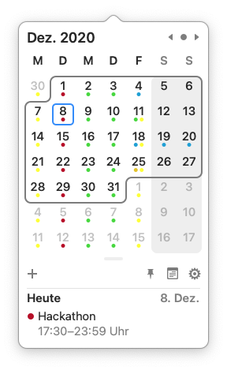

# ProgrammierBar
this is a repository for webdocs 20/21 assignement 2, organized by Alexander Müller and Carlo Bueckert (group 9)

## business description
The programmierbar is a local bar which mostly focuses on students.
It also offers a wide variety of events focused on students that are interested in computer science.
Example given the bar regulary hosts events such as LAN-parties and hackathons.
The owner regulary hosts such events himself, but also offers his bar as a location for others to host their events.
He also sells a small collection of merchandise at his store.
Since photography is a huge hobby of his, he takes fotos of whats happening at events or even at a normal evenings.

## website title, domain and purpose
Naturally, the website for the ProgrammierBar will be called programmierbar too.

As a fitting and available domain ".beer" is the desired choice.

The purpose of the whole website is to boost the online presence of the ProgrammierBar and the opportunity for potential guests and hosts alike to gain awareness of the ProgrammierBar and it's offers.
Because of that the owner wishes to establish a website where potential guests can see the offered drinks, a timetable of future events and a gallery of past events.
These past events are to be shown as photos, videos, or potential documents solving past hackathons.
Potential hosts for hackathons, LAN-parties and other events can submit their interest via this website as well.

## website design diagram
  

## at least 10 webpages with meaningful file name, title and content
webpage - filename - title - sample content (including pictures)  
startpage - index - The ProgrammierBar at Cottbus - c0  
events - events - Past and Future Events at the ProgrammierBar - c1  
gallerie - gallerie - Photos taken at the ProgrammierBar - c2  
impressum - impressum - Impressum - c3  
current month - calender\_view - An overwiev of the current month - c4  
about us - about\_us - About the ProgrammierBar - c5  
list of beverages - menu - Drinks we offer - c6  
merch - merch - Show your love - c7  
rental - rental - Rent us for events - c8  
login - login - Login with your account - c9  
data protection - data protection - Data Prtoteciton - Die ProgrammierBar - c10

-------
## Sample content

c0:  
We are the ProgrammierBar at Cottbus.  
You're welcome to join us for amazing hackathons, having fun at LAN-parties or just having a relaxing evening with your friends!  

c1:  
### Upcoming events  
**BTU Cottbus hosted Hackathon**  
18th Dec: the btu cottbus will host a hackathon focused on hacking routers  

**Christmas Special**  
23th Dec: as a special offer all drinks will be priced at a discount and special drinks including the  
requested "cinamon shot" will be available!

### Past events  
**Nicolaus is coming**  
6th Dec: every guest with recently cleaned boots gets a shot on the house  

c2:  
Welcome to our gallery! Here you can get an idea about our different events and its attendees.  
Whether karaoke, beerpong-competition or hackathon, there is something for everyone, as you can see.
Recently taken photos:  
  
  
  

c3:  
Impressum:  
John Doe
Street xy
Cottbus 03046
Telephone: 0123456789  

c4:  
<!-- <mark> a calender with markings for closed days, special days, days of events and so on </mark>  -->
Below you can see the current month with its events. The different colours stands for events of a private (red) or public nature. (green)  
  

c5:  
Description of the location, the ambient of the bar and the basic offers, e.g. beverages, events...  

c6:  
**cocktails**  
The drunken programmer 20€  
contains gin, vodka, differents juices and ice  

The deep sea diver 6€  
contains several gins and lime juice  

While true play beerpong (Beerpong) 12€   
a round of beerpong, with 2x 1L beer.  

**shots (2CL)**  
berlin air 2,40€  

jaegermeister 3,00€  

uni-code 2,00€  
(secret recipe) 

vodka parlament 2,40€  

lagavulin whiskey 5€

c7:  
<mark> default shopping view with e.g. a shirt showing of the programmierbar's logo </mark>  
Welcome in our ProgrammierBar-shop! Do you want to make an impression in front of friends or relatives?  
Then get an t-shirt, sweater or a original ProgrammierBar-bag to show your support for us.  
**New in our shop:** get a ProgrammierBar-mask to fight corona and all the problems that arise with the pandemic for local restaurents and bars!

c8:  
Rent us! Make your next celebration (birthday, christmas, oktoberfest, whatever!) something special.  
The location is the ideal choice for surprising the family and friends or create a relaxed atmosphere for colleagues with a party.  
Please send us your wishes and ideas with this formular and we will contact you shortly.  

c9:  
Good morning Sir. Please enter your account name and password, to continue.  

c10:  
1) Name and contact details of the person responsible for processing and the company data protection officer.  
2) Collection and storage of personal data as well as the type and purpose of their use.  
3) Transfer of data.

-------

## look and feel
The website should look minimalistic with focus on the important parts.
Like the bar itself the main colour of the website should be black.
Text and logos are desired to be white with an orange accent colour, like beer.
When hovering over an element which changes webpages, a hyperlink, or anything else to that matter the element is supposed to change colours, namely that the font gets black and the elements box tourns white.
Other than that there are no additional colours desired, to keep the website minimal.

To that matter the amount of decorative elements is to be kept as minimal as possible, including - at best only - the logo and boxes / lines to put emphasis on certain elements.

The whole website is visioned to consist of only one basic font, e.g. arial, with the only stilistic variations being the font being italic, bold or normal and a variaty of font sizes.

In terms of feels the whole website should feel like a single layout, which only changes content depending on the webpage thats currently visited.
The transition between these webpages is thought to be fast and not noticable to the user, so no visual indication is desired.
Every content should be accessible from every device, so the elements need to be resizable depending on the screen dimensions.
If the webpage demands a scrolling functionality, the scrolling needs to be visually without delay, so it needs to be smooth.

## XML/SVG/audio/video
Sample XML at "/dataDec-8-2020.xml"  

The branding/logo of the ProgrammierBar is black and white, minimilastic and consists of a glass of beer next to a laptop schematic.
It is desired that this logo will be modelled as a SVG and is always visible on the top left of the website.  

Also the owner of the bar wishes to present his bar with a quick video on his about webpage.  

## Developer Division of Tasks (REQUIREMENT)

## Kingsley
Base CSS and HTML Structure
Template Creation
Design of Home/Index.html
SVG Graphics and Page Photos
Photos for Shop and creation of merch.html
Galerie.html
Other CSS styling
JS Scripting (if necessary)

## Brishna
Creation of Calender / Events Pages
Page Content Creation (+5pages): 
AboutUs.html, 
Beverages.html, 
Rental.html, 
Login.html,
impressum, and 
DataProtection.html
Photos for Gallery
Other CSS styling
JS Scripting (if necessary)

## Images and media content used in this project
All images used in this project were taken from https://www.pixabay.com. "Pixabay is a vibrant community of creatives, sharing copyright free images, videos and music. All contents are released under the Pixabay License, which makes them safe to use without asking for permission or giving credit to the artist - even for commercial purposes".
